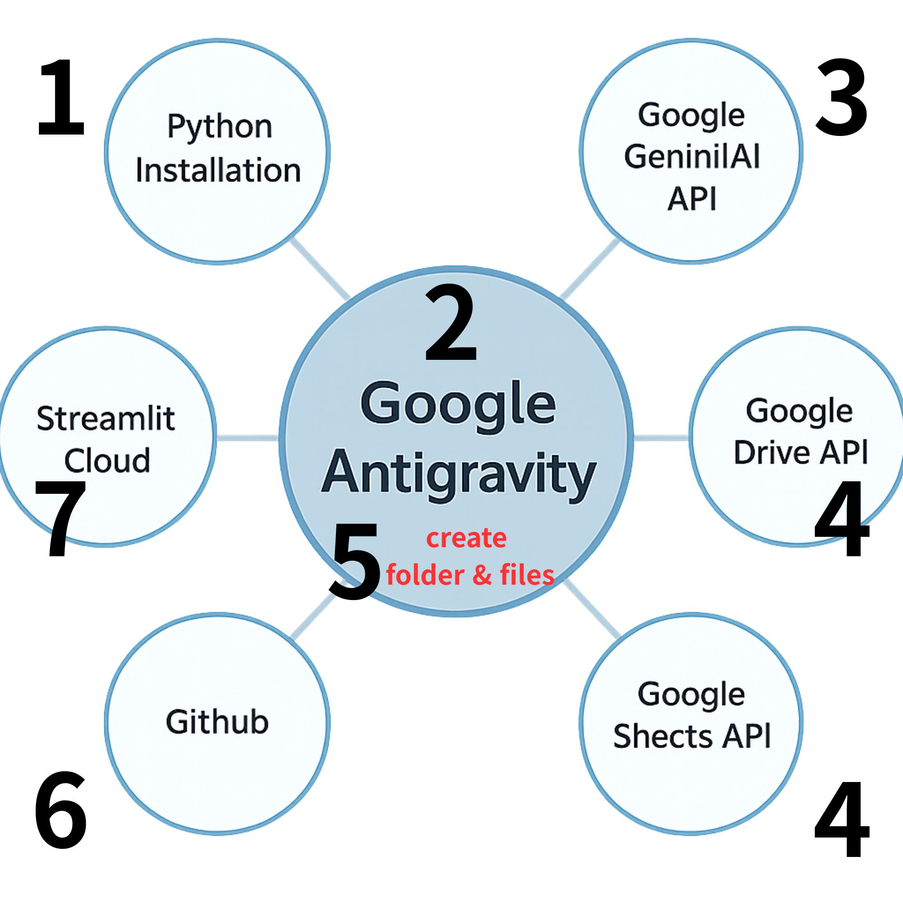

# 🤖 Daniel's AI English Learning App

> 📖 **Full step-by-step guide on my blog:**
> [How to Make an AI English Learning App with Antigravity](https://8mtree.com/en/how-to-make-ai-english-learning-app-with-antigravity)

---

## 🇬🇧 English Version

### 1. Purpose — Why I Built This

I enjoy learning English through YouTube videos, but I always struggled with one thing: **there was no easy way to save the sentences I wanted to study and get an instant explanation of how and when to use them.**

Taking notes by hand was slow. Searching for explanations online was scattered. I wanted a tool that would:
- Let me type in any English sentence
- Get an AI explanation instantly (in Korean, my native language)
- Automatically save it to a spreadsheet for review later

So instead of just wishing for it, I built it — using AI as my coding assistant.

---

### 2. Overview



**Tech Stack:**

| Tool | Role |
|------|------|
| [Google Antigravity](https://antigravity.dev) | AI coding assistant that wrote the app code |
| [Gemini 2.5 Flash API](https://aistudio.google.com) | AI brain that interprets English sentences |
| [Google Sheets API](https://console.cloud.google.com) | Database to store all studied sentences |
| [Streamlit](https://streamlit.io) | Framework to turn Python code into a web app |
| [GitHub](https://github.com) | Code storage and version control |

---

### 3. How It Was Built — Step by Step

#### STEP 0 — Install Python
Python is the programming language this app is written in. Without it, the computer cannot run the code.
👉 Download from [python.org](https://python.org) and make sure to check **"Add Python to PATH"** during installation.

#### STEP 1 — Use Google Antigravity as an AI Coding Assistant
Instead of learning to code from scratch, I used **Google Antigravity** — an AI coding assistant built into VS Code. I simply described what I wanted in plain language, and it wrote the Python code for me.

#### STEP 2 — Get a Gemini API Key (AI Brain)
The app needs permission to use Google's Gemini AI. This is done by getting a free API key from **Google AI Studio**.
👉 [https://aistudio.google.com](https://aistudio.google.com) → Get API Key

#### STEP 3 — Set Up Google Sheets API (Automated Spreadsheet)
To save study data automatically, I created a **Service Account** in Google Cloud — a robot account that can read and write to Google Sheets on behalf of the app. A `key.json` file (the robot's access key) was downloaded and placed in the project folder. The Google Sheet was then shared with the service account's email as an **Editor**.
👉 [https://console.cloud.google.com](https://console.cloud.google.com)

#### STEP 4 — Build the Project Folder
All files were organized in one folder:

```
English_learning/
├── app.py               ← Main app code
├── key.json             ← Google Sheets access key (NEVER upload this!)
├── requirements.txt     ← List of Python packages needed
├── .gitignore           ← Prevents secret files from being uploaded to GitHub
└── .streamlit/
    └── secrets.toml     ← Stores API keys securely
```

#### STEP 5 — Upload to GitHub
The project folder was uploaded to a **public GitHub repository** (excluding secret files). This serves as both a backup and the source that Streamlit Cloud reads from when deploying the app.

#### STEP 6 — Deploy on Streamlit Cloud
The GitHub repo was connected to **Streamlit Cloud**, which turned the Python code into a live website. Secret keys were entered in the **Secrets** section of the Streamlit dashboard so the app works securely without exposing them publicly.

---

### 4. 🌐 Live App

👉 **[Try the app here!](https://englishlearning-wbnebjgunysumhhgrjzwfp.streamlit.app)**
*(Replace this link with your actual Streamlit deployment URL)*

---
---

## 🇰🇷 한국어 버전

### 1. 목적 — 왜 이 앱을 만들었나요?

저는 유튜브를 보면서 영어를 공부하는 것을 즐깁니다. 하지만 항상 불편한 점이 있었어요. **공부한 문장을 쉽게 저장해두고, 그 문장이 어떤 상황에서 쓰이는지 바로 설명을 받을 방법이 없었던 거예요.**

손으로 적자니 느리고, 인터넷에서 따로 검색하자니 산만했습니다. 그래서 저는 이런 도구가 있으면 좋겠다고 생각했습니다:
- 공부하고 싶은 영어 문장을 입력하면
- AI가 한국어로 즉시 해석과 상황 설명을 해주고
- 그 내용이 자동으로 스프레드시트에 저장되는 앱

그래서 직접 만들었습니다 — 코딩 비서로 AI를 활용해서요.

---

### 2. 개요


**사용한 기술:**

| 도구 | 역할 |
|------|------|
| [Google Antigravity](https://antigravity.dev) | 앱 코드를 대신 짜준 AI 코딩 비서 |
| [Gemini 2.5 Flash API](https://aistudio.google.com) | 영어 문장을 해석해주는 AI 두뇌 |
| [Google Sheets API](https://console.cloud.google.com) | 공부한 문장을 저장하는 데이터베이스 |
| [Streamlit](https://streamlit.io) | 파이썬 코드를 웹사이트로 바꿔주는 프레임워크 |
| [GitHub](https://github.com) | 코드 저장 및 백업 공간 |

---

### 3. 만드는 과정 — 단계별 설명

#### STEP 0 — 파이썬(Python) 설치
파이썬은 이 앱이 사용하는 프로그래밍 언어입니다. 설치가 되어 있어야 컴퓨터가 코드를 읽을 수 있습니다.
👉 [python.org](https://python.org)에서 다운로드 후 설치 시 **"Add Python to PATH"** 체크 필수!

#### STEP 1 — 구글 안티그래비티로 코딩 비서 활용하기
저는 코딩을 처음부터 배우는 대신, **구글 안티그래비티** — VS Code에 내장된 AI 코딩 비서를 활용했습니다. 원하는 기능을 말로 설명하면 파이썬 코드를 대신 짜줍니다.

#### STEP 2 — 제미나이 API 키 발급 (AI 두뇌 연결)
앱이 구글 제미나이 AI를 사용하려면 허가증(API 키)이 필요합니다. **Google AI Studio**에서 무료로 발급받을 수 있습니다.
👉 [https://aistudio.google.com](https://aistudio.google.com) → Get API Key

#### STEP 3 — 구글 시트 API 설정 (자동 저장 기능)
공부한 내용을 자동으로 저장하기 위해, 구글 클라우드에서 **서비스 계정(로봇 전용 계정)** 을 만들었습니다. 이 로봇이 앱 대신 구글 시트에 글을 씁니다. 발급받은 `key.json` 파일을 프로젝트 폴더에 넣고, 내 구글 시트에 서비스 계정 이메일을 **편집자**로 공유했습니다.
👉 [https://console.cloud.google.com](https://console.cloud.google.com)

#### STEP 4 — 프로젝트 폴더 구성
모든 파일을 하나의 폴더 안에 정리했습니다:

```
English_learning/
├── app.py               ← 메인 앱 코드
├── key.json             ← 구글 시트 접근 열쇠 (절대 깃허브 업로드 금지!)
├── requirements.txt     ← 필요한 파이썬 패키지 목록
├── .gitignore           ← 비밀 파일이 깃허브에 올라가지 않도록 막는 파일
└── .streamlit/
    └── secrets.toml     ← API 키 등 비밀번호 보관함
```

#### STEP 5 — 깃허브에 업로드
비밀 파일을 제외한 나머지 파일들을 **공개 깃허브 레포지토리**에 올렸습니다. 코드 백업 역할과 동시에, Streamlit이 배포 시 코드를 가져오는 창고 역할을 합니다.

#### STEP 6 — Streamlit Cloud로 웹사이트 배포
깃허브 레포를 **Streamlit Cloud**에 연결해 파이썬 코드를 실제 웹사이트로 만들었습니다. Streamlit 대시보드의 **Secrets** 메뉴에 API 키를 입력해 앱이 안전하게 작동할 수 있도록 했습니다.

---

### 4. 🌐 완성된 웹사이트

👉 **[앱 바로 가기!](https://englishlearning-wbnebjgunysumhhgrjzwfp.streamlit.app)**
*(실제 Streamlit 배포 URL로 교체해 주세요)*
